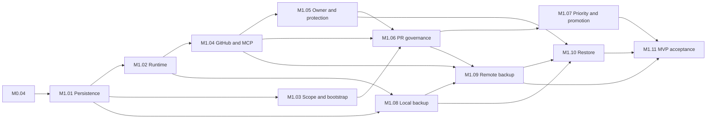

# Delivery plan

This plan defines 23 phases and 110 tasks. **Each phase produces one integration PR.** A milestone spans several phases. Task branches/worktrees contribute reviewed commits to the phase; a task does not require a separate PR.

Start with [foundation readiness](readiness.md), [parallel delivery](parallel-delivery.md), and [open decisions](decisions.md). The [canonical backlog](backlog.json) contains ownership, contracts, start and integration dependencies, acceptance scenarios, and verification for every task. The phase pages below are generated from it and checked in CI. They describe planned work, not completed implementation.

## Phase roadmap

| Phase / PR | Outcome | Must merge after |
| --- | --- | --- |
| [F0: Development environment, GitHub foundation, and delivery plan](phases/F0.md) | An isolated Windows/Linux development workflow, checked GitHub CI configuration, and an executable phase/task plan. | None |
| [F0.01: Per-task TDD and evidence enforcement](phases/F0.01.md) | Require meaningful RED/GREEN cycles, justified documentation exceptions, and checked phase evidence. | F0 |
| [F0.02: Restore TDD checkpoint ancestry](phases/F0.02.md) | Preserve original RED/GREEN commits after the squash of PR #4 without changing implementation or weakening validation. | F0.01 |
| [M0.01: Immutable contract values](phases/M0.01.md) | Real, tested Go domain values for deterministic artifact identity, immutable canonical snapshots, and the MVP authority boundary. | F0.02 |
| [M0.02: Exact proposals and human consent](phases/M0.02.md) | Immutable proposal revisions, explicit approval bindings, ordered consent/revocation rules, and source-bound integrity assessments. | M0.01 |
| [M0.03: Guarded canonical transitions](phases/M0.03.md) | Pure domain decisions for canonical promotion, both bootstrap paths, corrective history, and local scheduling fences. | M0.02 |
| [M0.04: Atomic application coordination and milestone proof](phases/M0.04.md) | Application use cases coordinate domain outcomes through a consumed atomic boundary, proven with a test-only reference store and deterministic race/retry scenarios. | M0.03 |
| [M1.01: Persistent canonical state and artifact storage](phases/M1.01.md) | Persist M0 authority rules with atomic PostgreSQL transactions and immutable local artifact bytes. | M0.04 |
| [M1.02: Durable reconciliation runtime](phases/M1.02.md) | Recover durable work after retries/restarts and expose bounded, scoped operational state. | M1.01 |
| [M1.03: Protected inventory and two-path bootstrap](phases/M1.03.md) | Create exact reviewable proposals for existing repositories and first-test PRs without candidate authority. | M1.01 |
| [M1.04: GitHub polling and scoped MCP](phases/M1.04.md) | Discover/reconcile PRs over outbound GitHub access with MCP acceleration and independent periodic recovery. | M1.02 |
| [M1.05: Owner onboarding and confirmed protection](phases/M1.05.md) | Connect an explicitly authorized human and enable or repair required protection through a scoped reviewed operation. | M1.04 |
| [M1.06: PR commands and integrity checks](phases/M1.06.md) | Turn trusted PR observations into exact approval/revocation outcomes, integrity assessments and recoverable GitHub publication. | M1.03, M1.04, M1.05 |
| [M1.07: Priority transfer and integrated promotion](phases/M1.07.md) | Coordinate one active contract-changing PR per Suite and conditionally promote only exact approved integrated contracts. | M1.06 |
| [M1.08: Encrypted snapshots and local recovery copy](phases/M1.08.md) | Create consistent project archives containing all claimed history and unique referenced bytes, encrypted for one external instance kit. | M1.01, M1.02 |
| [M1.09: Remote backup health and contingency](phases/M1.09.md) | Publish encrypted snapshots independently of product releases, track verified coverage and prepare reviewable contingency changes. | M1.08, M1.04, M1.06 |
| [M1.10: Guided isolated restore](phases/M1.10.md) | Validate/import an archive while the service is offline and guide safe authorized reconnection without rewriting healthy project authority. | M1.08, M1.05, M1.09 |
| [M1.11: Self-hosted integrity MVP acceptance](phases/M1.11.md) | Deliver an installable supported M1 with exercised governance, backup, restore and honest integrity-only assurance. | M1.07, M1.09, M1.10 |
| [M2.01: Execution profile and isolation decisions](phases/M2.01.md) | Resolve first-ecosystem and execution-trust decisions through bounded research/spikes before execution implementation. | M1.11 |
| [M2.02: Trusted execution plans and evidence binding](phases/M2.02.md) | Extend domain/application assurance with approved executable profiles and exact verifiable execution identities. | M2.01 |
| [M2.03: Docker execution backend](phases/M2.03.md) | Run the accepted profile and collect trusted results while enforcing the accepted runtime isolation boundary. | M2.02 |
| [M2.04: Execution-aware governance and operations](phases/M2.04.md) | Integrate execution into required checks and post-integration promotion with clear operational status and no assurance downgrade. | M2.02, M2.03 |
| [M3.01: Threat-driven hardening selection](phases/M3.01.md) | Select only hardening controls justified by observed threats and operational evidence; define later phase proposals without speculative implementation. | M2.04 |

## How work advances

The M1 phase integration graph below shows where independent delivery paths converge. Task starts can happen earlier, according to their reviewed contracts.

F0 established the engineering environment, GitHub foundation, and this plan. F0.01 adds the accepted [TDD policy](../tdd.md) and its evidence gate. F0.02 repairs the checkpoint ancestry omitted by the squash of PR #4; product implementation requires F0.02-I and a verified repaired main. C0 contract/document preparation may start sooner. M0 then proves domain and application invariants without services; M1 delivers durable integrity governance, required checks, backups, and guided recovery. M2 adds canonical execution after selecting the first customer profile and isolation policy. M3 selects hardening from demonstrated threats; it does not pre-authorize a signing or cloud stack.

For M0.01, the artifact, authority, and immutable snapshot lanes start together after C0. M0.02 contract preparation can overlap those implementations. Each later phase distinguishes needs_to_start from needs_to_merge; phase merge ordering is not a blanket development start barrier. Use reviewed interfaces and small test fakes to reduce blocking, then prove the actual components together.

In M1, persistence/CAS starts from M0 transaction contracts. Inventory/bootstrap design, GitHub adapter contracts, and backup-format work can progress independently. Local backup implementation does not wait for the complete PR governance flow. Recovery, remote publication, and priority handling converge only where their actual production dependencies require it. Open gates block their named implementation tasks, not unrelated lanes.

The [M0 contract brief](m0-contracts.md) defines the initial review packet. Actual consumed signatures, encoding, errors, and examples are finalized at C0 checkpoints. All tasks include their own tests. The integration lane proves combined behavior and real adapter guarantees; it is not a substitute for worker testing.

The plan does not select managed hosting or hosted execution versus customer infrastructure. M1 remains self-hosted and outbound-only; later cloud delivery must preserve the same authority boundaries. Additional M3 implementation phases are written only after M3.01 selects a concrete control, each with one PR and producer/verifier/recovery work.

## Maintaining and executing the plan

Edit backlog.json, then run `./scripts/check-plan.ps1 -WriteDocs`. Default `./scripts/check-plan.ps1` checks references, ownership, dependency cycles, contract ownership, TDD obligations, and generated-page freshness. `./scripts/test-plan.ps1` exercises rejection of malformed plans. Every future task declares required TDD or justified documentation/decision-only non-applicability. F0 remains historical: no retroactive TDD proof is claimed. Update this roadmap and decision register when phase outcomes or gates change.

Before publishing, commit `docs/plan/executions/<phase>.json` and run `./scripts/check-tdd.ps1 -BaseRevision <base-commit> -HeadRevision HEAD`. The evidence record covers every changed file and every task in the phase. Retain worker checkpoint commits when integrating branches so the recorded RED/GREEN revisions remain reachable. Passing this structural check complements independent review; it cannot establish the truth or relevance of an asserted test result.

At dispatch, record assignee, worktree, contract revision, ownership, and evidence that start prerequisites are satisfied. Use the [task evidence template](task-evidence-template.md). Neither an existing task entry nor a green CI run proves completion or grants merge authority. Publish through the authorized bot; the user authorizes each merge.
